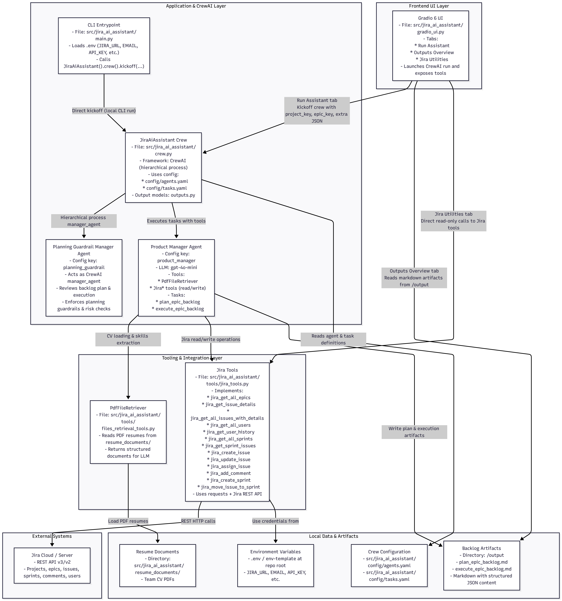
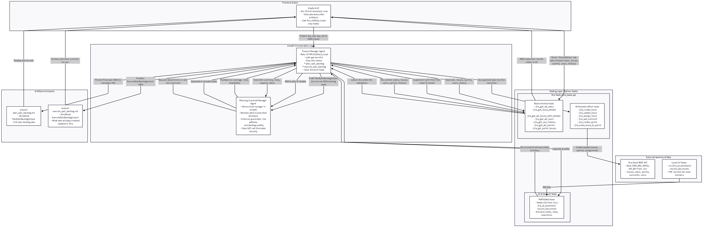

# Jira AI Assistant Crew

An AI-powered Jira assistant built on [crewAI](https://crewai.com) that:

- Analyzes a Jira epic, your team’s CVs, and Jira history.
- Designs a complete, executable backlog (Stories, Tasks, Bugs, Sub-tasks).
- Assigns work based on skills and capacity.
- Optionally creates and updates issues directly in Jira.
- Exposes both a CLI flow and a Gradio 6 web UI.

The system uses a multi‑agent CrewAI setup with one execution agent (AI Product Manager) and one manager/guardrail agent that reviews planning and execution decisions.

---

## Objective

The objective of this agent is to behave like an AI Product Manager & Delivery Lead for a given Jira epic:

- Understand epic scope, constraints, and existing work.
- Analyze team capacity and skills using Jira history and CVs.
- Generate a detailed, sprint-ready backlog (including sub-tasks, estimates, and schedule hints).
- Execute the plan in Jira (create/update issues, assign, and place in sprints) while documenting risks and decisions.

Two main CrewAI tasks implement this flow:

- `plan_epic_backlog`: designs the backlog and writes `output/plan_epic_backlog.md` (structured JSON in markdown).
- `execute_epic_backlog`: turns the plan into real Jira issues and writes `output/execute_epic_backlog.md`.

---

## System Architecture & Agent Flow

Source diagrams live under `system_architecture/`:

- `system_architecture/system_overview.mmd`
- `system_architecture/agent_flow.mmd`

Rendered PNGs (ready for docs, slides, or wikis) are already included:

- `system_architecture/system_overview.png`
- `system_architecture/agent_flow.png`

You can embed them directly in documentation:




---


## Environment & Configuration

This project reads configuration from a `.env` file at the repository root. A template is provided.

### 1. Create `.env` from `env-template`

From the project root:

```bash
cp env-template .env            # macOS / Linux
copy env-template .env          # Windows (PowerShell / CMD)
```

Then open `.env` and fill in:

- `JIRA_URL` – your Jira base URL, e.g. `https://your-domain.atlassian.net`
- `EMAIL` – the email associated with your Jira/Atlassian account
- `API_KEY` – an API token generated from your Atlassian account
- `CREWAI_TRACING_ENABLED` – `true` or `false` (optional; enables crewAI tracing if configured)
- `OPENAI_API_KEY` – your OpenAI API key used by CrewAI LLM agents

### 2. How environment is loaded

- `src/jira_ai_assistant/tools/jira_tools.py` calls `load_jira_env()` to ensure Jira env vars are available before making REST calls.
- `src/jira_ai_assistant/main.py` uses `python-dotenv` (`load_dotenv()`) to load `.env` when running via the CLI.
- The Gradio UI (`gradio_ui.py`) also relies on these environment variables being present when the process starts.

---

## Installation

Ensure you have **Python `>=3.10,<3.14`** installed.

This project uses [uv](https://docs.astral.sh/uv/) for dependency management.

1. Install `uv` (if you don’t already have it):

   ```bash
   pip install uv
   ```

2. From the project root, install dependencies (this creates/uses `.venv` and respects `uv.lock`):

   ```bash
   uv sync
   ```

3. (Optional) If you use the `crewai` CLI, you can also install its dependencies via:

   ```bash
   crewai install
   ```

---

## Running the Project (CLI)

There are two main ways to run the crew from the command line.

### 1. CrewAI CLI

From the project root:

```bash
crewai run
```

This uses the configuration in:

- `src/jira_ai_assistant/config/agents.yaml`
- `src/jira_ai_assistant/config/tasks.yaml`

and will:

- Run `plan_epic_backlog` and `execute_epic_backlog` using the CrewAI pipeline.
- Write outputs to `output/plan_epic_backlog.md` and `output/execute_epic_backlog.md`.

### 2. Python / uv console script

The `pyproject.toml` defines a `jira_ai_assistant` console script that points to `src/jira_ai_assistant/main.py`.

After `uv sync`, you can run:

```bash
uv run jira_ai_assistant
```

or, if you activate the virtual environment created by `uv`:

```bash
python -m jira_ai_assistant.main
```

The default `run()` in `main.py` currently uses hardcoded sample inputs:

- `project_key = "MH"`
- `epic_key = "MH-3"`

You can edit `src/jira_ai_assistant/main.py` to change these values for your own project and epic keys.

---

## Launching the Gradio UI

Prefer a browser-based dashboard instead of the CLI? Use the Gradio 6 UI.

### 1. Ensure dependencies and `.env` are set

- Follow the “Installation” and “Environment & Configuration” sections above.
- Make sure `.env` contains valid Jira and OpenAI credentials.

### 2. Start the UI

From the project root:

```bash
uv run jira_ai_assistant_ui
```

or, inside an activated virtual environment:

```bash
python -m jira_ai_assistant.gradio_ui
```

Gradio will print a local URL (for example, `http://127.0.0.1:7860`) to your terminal—open it in your browser.

---

## Repository Layout

Key parts of the implementation:

- `pyproject.toml`  
  Project metadata, Python version (`>=3.10,<3.14`), dependencies, and console scripts:
  - `jira_ai_assistant` → `jira_ai_assistant.main:run` (CLI entrypoint)
  - `jira_ai_assistant_ui` → `jira_ai_assistant.gradio_ui:launch` (Gradio UI)

- `env-template` / `.env`  
  Environment configuration for Jira and OpenAI (see “Environment & Configuration”).

- `src/jira_ai_assistant/crew.py`  
  CrewAI setup:
  - `JiraAiAssistant` crew.
  - `product_manager` agent wired with all tools.
  - `plan_epic_backlog` and `execute_epic_backlog` tasks.
  - Hierarchical `planning_guardrail` manager agent for guardrails.

- `src/jira_ai_assistant/config/agents.yaml`  
  Agent definitions:
  - `product_manager`: AI Product Manager & Delivery Lead.
  - `planning_guardrail`: manager agent that reviews plans & execution, enforces guardrails, and never calls Jira tools directly.

- `src/jira_ai_assistant/config/tasks.yaml`  
  Task definitions:
  - `plan_epic_backlog`: planning, backlog design, risk capture.
  - `execute_epic_backlog`: issue creation, assignment, sprint allocation, and capacity notes.

- `src/jira_ai_assistant/tools/jira_tools.py`  
  All Jira REST tools (see “Tools & Integrations”).

- `src/jira_ai_assistant/tools/files_retrieval_tools.py`  
  `PdfFileRetriever` for reading PDF CVs from `src/jira_ai_assistant/resume_documents/`.

- `src/jira_ai_assistant/outputs.py`  
  Pydantic models defining the structured outputs for:
  - `PlanEpicBacklogOutput`
  - `ExecuteEpicBacklogOutput`

- `src/jira_ai_assistant/gradio_ui.py`  
  Gradio 6 UI with three tabs:
  - **Run Assistant**: kick off the full crew on a given project/epic.
  - **Outputs Overview**: view the latest `plan_epic_backlog.md` and `execute_epic_backlog.md`.
  - **Jira Utilities**: read-only inspection of epics, issues, sprints, users, and user history.

- `src/jira_ai_assistant/main.py`  
  Simple CLI entrypoint used by the `jira_ai_assistant` console script. Loads `.env` via `python-dotenv` and calls the crew with sample `project_key` and `epic_key` (you can edit these for local runs).

- `output/`  
  Generated artifacts:
  - `output/plan_epic_backlog.md`
  - `output/execute_epic_backlog.md`

- `src/jira_ai_assistant/resume_documents/`  
  Folder for team CV PDFs used by `PdfFileRetriever`.

---

### 3. UI tabs & capabilities

- **Run Assistant**  
  - Enter `Project Key` (e.g. `MH`) and `Epic Key` (e.g. `MH-3`).  
  - Click **“Run Your AI JIRA Assistant!”** to:
    - Kick off the full crew (`plan_epic_backlog` + `execute_epic_backlog`).
    - See structured results in the `Crew Result` panel.
    - View the latest `plan_epic_backlog.md` and `execute_epic_backlog.md`.

- **Outputs Overview**  
  - Click **“Refresh from disk”** to reload `output/plan_epic_backlog.md` and `output/execute_epic_backlog.md` without running a new crew.

- **Jira Utilities**  
  - Read-only tools to explore your Jira data:
    - List epics, issues, sprints, and assignable users for a project.
    - Inspect a single issue by key.
    - Inspect issues in a specific sprint.
    - View detailed user history by Jira `accountId`.

---


## Tools & Integrations

### CV / Resume Tool

- `pdf_file_retriever` (`PdfFileRetriever` in `src/jira_ai_assistant/tools/files_retrieval_tools.py`)
  - Reads all PDFs in a directory (default: `src/jira_ai_assistant/resume_documents/`) or a single PDF file.
  - Returns extracted text as a list of strings (one per PDF).
  - Used by the `product_manager` agent to understand skills, roles, and experience.

### Jira Tools

All Jira tools live in `src/jira_ai_assistant/tools/jira_tools.py` and use:

- `JIRA_URL`
- `EMAIL`
- `API_KEY`

loaded via the helper `load_jira_env()` from `utils.py`.

The main tools:

- `jira_get_all_epics` (`JiraGetAllEpicsTool`)  
  List all epics in a project.

- `jira_get_issue_details` (`JiraGetIssueDetailsTool`)  
  Fetch full details of a single issue (description, status, fields).

- `jira_get_all_issues_with_details` (`JiraGetAllIssuesWithDetailsTool`)  
  Read all issues in a project, optionally filtered by epic.

- `jira_get_all_users` (`JiraGetAllUsersTool`)  
  Retrieve assignable users/account IDs in the project.

- `jira_get_user_history` (`JiraGetUserHistoryTool`)  
  Analyze a user’s historical work to infer skills, throughput, and workload.

- `jira_get_all_sprints` (`JiraGetAllSprintsTool`)  
  List sprints for a board/project.

- `jira_get_sprint_issues` (`JiraGetSprintIssuesTool`)  
  Inspect which issues are in a given sprint.

- `jira_create_issue` (`JiraCreateIssueTool`)  
  Create Stories, Tasks, Bugs, or Sub-tasks under the correct epic/parent.

- `jira_update_issue` (`JiraUpdateIssueTool`)  
  Update fields like summary, description, dates, story points, status, etc.

- `jira_assign_issue` (`JiraAssignIssueTool`)  
  Assign issues by Jira `accountId`.

- `jira_add_comment` (`JiraAddCommentTool`)  
  Add plain-text comments to issues (e.g., risks, clarifications, capacity notes).

- `jira_create_sprint` (`JiraCreateSprintTool`)  
  Create sprints on a Jira board when needed.

- `jira_move_issue_to_sprint` (`JiraMoveIssueToSprintTool`)  
  Move issues into a specific sprint to balance workload.

These tools are all attached to the `product_manager` agent in `crew.py` and are never called directly by the guardrail/manager agent.

---

## Customizing the Assistant

You can adapt the assistant to your own workflows:

- **Agents** (`src/jira_ai_assistant/config/agents.yaml`)
  - Tune the `product_manager` agent’s role, goal, backstory, and LLM parameters.
  - Adjust the `planning_guardrail` agent’s guardrail policies.

- **Tasks** (`src/jira_ai_assistant/config/tasks.yaml`)
  - Modify prompt instructions and expected JSON output for:
    - `plan_epic_backlog`
    - `execute_epic_backlog`

- **Crew wiring** (`src/jira_ai_assistant/crew.py`)
  - Add or remove tools from the `product_manager` agent.
  - Change process configuration (still hierarchical) or replace the manager agent if needed.

- **Inputs & defaults** (`src/jira_ai_assistant/main.py` and `gradio_ui.py`)
  - Edit default project/epic keys in `main.py` for quick local runs.
  - Adjust UI labels, defaults, or add extra inputs in the Gradio tabs.

- **Resumes & context** (`src/jira_ai_assistant/resume_documents/`)
  - Add or update PDF CVs for your team; the `PdfFileRetriever` will read all PDFs in this folder.

---

## Support & Further Reading

For more about CrewAI itself:

- Documentation: https://docs.crewai.com
- GitHub: https://github.com/joaomdmoura/crewai
- Discord: https://discord.com/invite/X4JWnZnxPb

This repo builds on the CrewAI template but adds a concrete Jira‑centric implementation with:

- A focused epic planning & execution objective.
- A full set of Jira REST tools.
- Structured backlog and execution outputs.
- A ready-to-use Gradio control center.

Use it as-is for your Jira project, or as a starting point for a more customized, production-ready Jira AI assistant.
